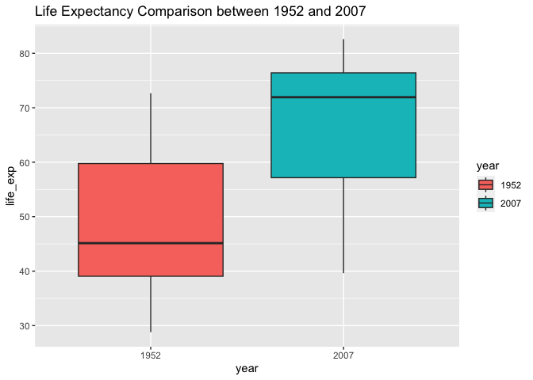
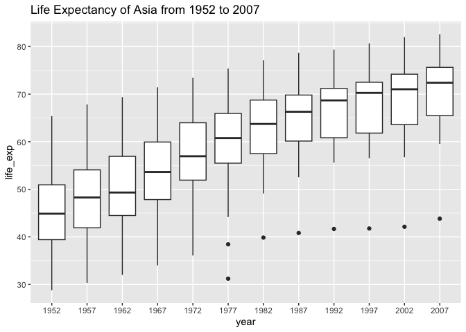
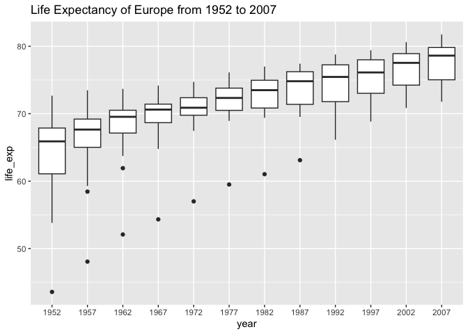
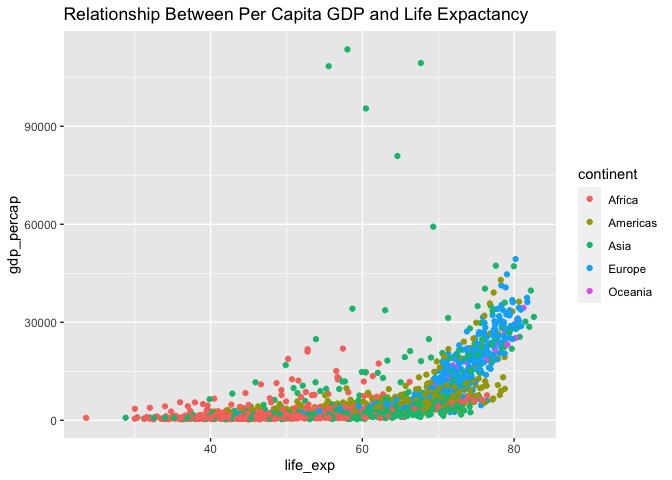
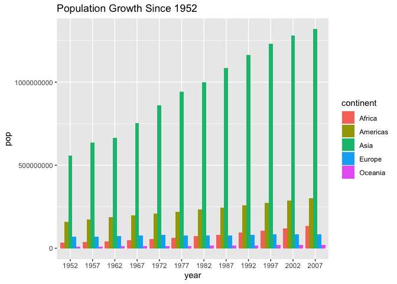
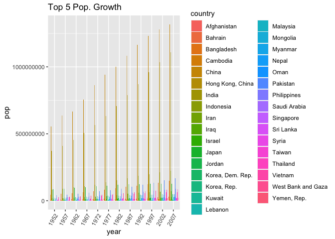
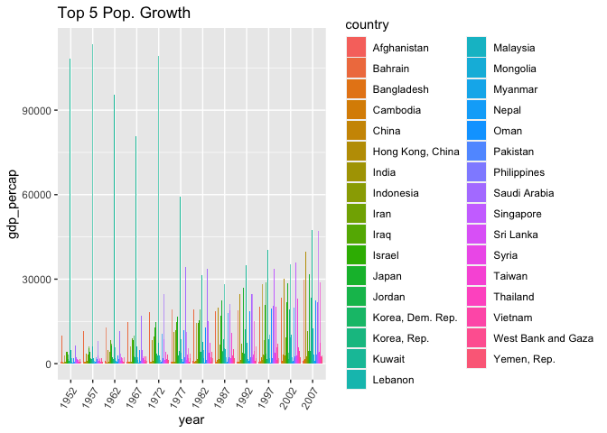

## Instructions

Answer the following questions and complete the exercises in RMarkdown. Please embed all of your code and push your final work to your repository. Your final lab report should be organized, clean, and run free from errors. Remember, you must remove the `#` for the included code chunks to run. Be sure to add your name to the author header above. For any included plots, make sure they are clearly labeled. You are free to use any plot type that you feel best communicates the results of your analysis.

**In this homework, you should make use of the aesthetics you have learned. It's OK to be flashy!**

Make sure to use the formatting conventions of RMarkdown to make your report neat and clean!

## Load the libraries


```r
library(tidyverse)
library(janitor)
library(here)
library(naniar)
```


```r
options(scipen = 999)
```

## Resources

The idea for this assignment came from [Rebecca Barter's](http://www.rebeccabarter.com/blog/2017-11-17-ggplot2_tutorial/) ggplot tutorial so if you get stuck this is a good place to have a look.

## Gapminder

For this assignment, we are going to use the dataset [gapminder](https://cran.r-project.org/web/packages/gapminder/index.html). Gapminder includes information about economics, population, and life expectancy from countries all over the world. You will need to install it before use. This is the same data that we will use for midterm 2 so this is good practice.


```r
#install.packages("gapminder")
library("gapminder")
```

## Questions

The questions below are open-ended and have many possible solutions. Your approach should, where appropriate, include numerical summaries and visuals. Be creative; assume you are building an analysis that you would ultimately present to an audience of stakeholders. Feel free to try out different `geoms` if they more clearly present your results.

**1. Use the function(s) of your choice to get an idea of the overall structure of the data frame, including its dimensions, column names, variable classes, etc. As part of this, determine how NAs are treated in the data.**


```r
gapminder <- gapminder %>% 
  clean_names()
```


```r
glimpse(gapminder)
```

```
## Rows: 1,704
## Columns: 6
## $ country    <fct> "Afghanistan", "Afghanistan", "Afghanistan", "Afghanistan",…
## $ continent  <fct> Asia, Asia, Asia, Asia, Asia, Asia, Asia, Asia, Asia, Asia,…
## $ year       <int> 1952, 1957, 1962, 1967, 1972, 1977, 1982, 1987, 1992, 1997,…
## $ life_exp   <dbl> 28.801, 30.332, 31.997, 34.020, 36.088, 38.438, 39.854, 40.…
## $ pop        <int> 8425333, 9240934, 10267083, 11537966, 13079460, 14880372, 1…
## $ gdp_percap <dbl> 779.4453, 820.8530, 853.1007, 836.1971, 739.9811, 786.1134,…
```


```r
gapminder %>% 
  map_df(~ sum(is.na(.)))
```

```
## # A tibble: 1 × 6
##   country continent  year life_exp   pop gdp_percap
##     <int>     <int> <int>    <int> <int>      <int>
## 1       0         0     0        0     0          0
```

**2. Among the interesting variables in gapminder is life expectancy. How has global life expectancy changed between 1952 and 2007?**


```r
gapminder %>% 
  filter(between(year, 1952, 2007)) %>% 
  mutate(year=as.factor(year)) %>%
  group_by(year, life_exp)
```

```
## # A tibble: 1,704 × 6
## # Groups:   year, life_exp [1,700]
##    country     continent year  life_exp      pop gdp_percap
##    <fct>       <fct>     <fct>    <dbl>    <int>      <dbl>
##  1 Afghanistan Asia      1952      28.8  8425333       779.
##  2 Afghanistan Asia      1957      30.3  9240934       821.
##  3 Afghanistan Asia      1962      32.0 10267083       853.
##  4 Afghanistan Asia      1967      34.0 11537966       836.
##  5 Afghanistan Asia      1972      36.1 13079460       740.
##  6 Afghanistan Asia      1977      38.4 14880372       786.
##  7 Afghanistan Asia      1982      39.9 12881816       978.
##  8 Afghanistan Asia      1987      40.8 13867957       852.
##  9 Afghanistan Asia      1992      41.7 16317921       649.
## 10 Afghanistan Asia      1997      41.8 22227415       635.
## # ℹ 1,694 more rows
```


```r
gapminder %>% 
  filter(between(year, 1952, 2007)) %>% 
  mutate(year=as.factor(year)) %>%
  group_by(year, life_exp) %>% 
  summarize(n=n(), .groups = "keep") %>% 
  ggplot(aes(x=year, y=life_exp, group = year, fill = year))+
  geom_boxplot()+
  labs(title = "Global Life Expectancy Between 1952-2007")
```

<!-- -->

**3. How do the distributions of life expectancy compare for the years 1952 and 2007?**


```r
gapminder %>% 
  filter(year=="1952" | year=="2007") %>% 
  mutate(year=as.factor(year)) %>%
  group_by(year, life_exp) %>% 
  summarize(n=n(), .groups = "keep")
```

```
## # A tibble: 284 × 3
## # Groups:   year, life_exp [284]
##    year  life_exp     n
##    <fct>    <dbl> <int>
##  1 1952      28.8     1
##  2 1952      30       1
##  3 1952      30.0     1
##  4 1952      30.3     1
##  5 1952      31.3     1
##  6 1952      32.0     1
##  7 1952      32.5     1
##  8 1952      32.5     1
##  9 1952      33.0     1
## 10 1952      33.6     1
## # ℹ 274 more rows
```


```r
gapminder %>% 
  filter(year=="1952" | year=="2007") %>% 
  mutate(year=as.factor(year)) %>%
  group_by(year, life_exp) %>% 
  summarize(n=n(), .groups = "keep") %>% 
  ggplot(aes(x=year, y=life_exp, group = year, fill = year))+
  geom_boxplot()+
  labs(title = "Life Expectancy Comparison between 1952 and 2007")
```

<!-- -->

**4. Your answer above doesn't tell the whole story since life expectancy varies by region. Make a summary that shows the min, mean, and max life expectancy by continent for all years represented in the data.**


```r
gapminder %>%
  filter(continent=="Africa") %>% 
  summarize(mean_life_exp=mean(life_exp),
            max_life_exp=max(life_exp),
            min_life_exp=min(life_exp))
```

```
## # A tibble: 1 × 3
##   mean_life_exp max_life_exp min_life_exp
##           <dbl>        <dbl>        <dbl>
## 1          48.9         76.4         23.6
```


```r
gapminder %>% 
  filter(continent=="Americas") %>% 
   summarize(mean_life_exp=mean(life_exp),
            max_life_exp=max(life_exp),
            min_life_exp=min(life_exp))
```

```
## # A tibble: 1 × 3
##   mean_life_exp max_life_exp min_life_exp
##           <dbl>        <dbl>        <dbl>
## 1          64.7         80.7         37.6
```


```r
gapminder %>% 
  filter(continent=="Asia") %>% 
   summarize(mean_life_exp=mean(life_exp),
            max_life_exp=max(life_exp),
            min_life_exp=min(life_exp))
```

```
## # A tibble: 1 × 3
##   mean_life_exp max_life_exp min_life_exp
##           <dbl>        <dbl>        <dbl>
## 1          60.1         82.6         28.8
```


```r
gapminder %>% 
  filter(continent=="Europe") %>% 
   summarize(mean_life_exp=mean(life_exp),
            max_life_exp=max(life_exp),
            min_life_exp=min(life_exp))
```

```
## # A tibble: 1 × 3
##   mean_life_exp max_life_exp min_life_exp
##           <dbl>        <dbl>        <dbl>
## 1          71.9         81.8         43.6
```


```r
gapminder %>% 
  filter(continent=="Oceania") %>% 
   summarize(mean_life_exp=mean(life_exp),
            max_life_exp=max(life_exp),
            min_life_exp=min(life_exp))
```

```
## # A tibble: 1 × 3
##   mean_life_exp max_life_exp min_life_exp
##           <dbl>        <dbl>        <dbl>
## 1          74.3         81.2         69.1
```

**5. How has life expectancy changed between 1952-2007 for each continent?**

```r
gapminder %>% 
  filter(continent=="Africa" & between(year, 1952, 2007)) %>% 
  mutate(year=as.factor(year)) %>%
  group_by(year, life_exp) %>% 
  summarize(n=n(), .groups = "keep") %>% 
  ggplot(aes(x=year, y=life_exp))+
  geom_boxplot()+
  labs(title = "Life Expectancy of Africa from 1952 to 2007")
```

<!-- -->


```r
gapminder %>% 
  filter(continent=="Americas" & between(year, 1952, 2007)) %>% 
  mutate(year=as.factor(year)) %>%
  group_by(year, life_exp) %>% 
  summarize(n=n(), .groups = "keep") %>% 
  ggplot(aes(x=year, y=life_exp))+
  geom_boxplot()+
  labs(title = "Life Expectancy of the Americas from 1952 to 2007")
```

<!-- -->


```r
gapminder %>% 
  filter(continent=="Asia" & between(year, 1952, 2007)) %>% 
  mutate(year=as.factor(year)) %>%
  group_by(year, life_exp) %>% 
  summarize(n=n(), .groups = "keep") %>% 
  ggplot(aes(x=year, y=life_exp))+
  geom_boxplot()+
  labs(title = "Life Expectancy of Asia from 1952 to 2007")
```

<!-- -->


```r
gapminder %>% 
  filter(continent=="Europe" & between(year, 1952, 2007)) %>%
  mutate(year=as.factor(year)) %>%
  group_by(year, life_exp) %>% 
  summarize(n=n(), .groups = "keep") %>% 
  ggplot(aes(x=year, y=life_exp))+
  geom_boxplot()+
  labs(title = "Life Expectancy of Europe from 1952 to 2007")
```

<!-- -->


```r
gapminder %>% 
  filter(continent=="Oceania" & between(year, 1952, 2007)) %>%
  mutate(year=as.factor(year)) %>%
  group_by(year, life_exp) %>% 
  summarize(n=n(), .groups = "keep") %>% 
  ggplot(aes(x=year, y=life_exp))+
  geom_boxplot()+
  labs(title = "Life Expectancy of Oceania from 1952 to 2007")
```

<!-- -->

**6. We are interested in the relationship between per capita GDP and life expectancy; i.e. does having more money help you live longer?**

```r
gapminder %>% 
  ggplot(aes(x=life_exp, y=gdp_percap, color = continent))+
  geom_jitter()+
  labs(title = "Relationship Between Per Capita GDP and Life Expactancy")
```

<!-- -->

**7. Which countries have had the largest population growth since 1952?**

```r
gapminder %>%
  mutate(year=as.factor(year)) %>%
  ggplot(aes(x=year, y= pop, fill = continent))+
  geom_col(position = "dodge")+
  labs(title = "Population Growth Since 1952")
```

<!-- -->

**8. Use your results from the question above to plot population growth for the top five countries since 1952.**

```r
gapminder %>% 
  filter(continent=="Asia") %>% 
  mutate(year=as.factor(year)) %>%
  ggplot(aes(x=year, y= pop, fill = country))+
  geom_col(position = "dodge")+
  theme(axis.text.x = element_text(angle = 60, hjust = 1))+
  labs(title = "Top 5 Pop. Growth")
```

<!-- -->

**9. How does per capita GDP growth compare between these same five countries?**

```r
gapminder %>% 
  filter(continent=="Asia") %>% 
  mutate(year=as.factor(year)) %>%
  ggplot(aes(x=year, y= gdp_percap, fill = country))+
  geom_col(position = "dodge")+
  theme(axis.text.x = element_text(angle = 60, hjust = 1))+
  labs(title = "Top 5 Pop. Growth")
```

<!-- -->

**10. Make one plot of your choice that uses faceting!**

```r
gapminder %>%
  mutate(year=as.factor(year)) %>%
  ggplot(aes(x=year, y=life_exp))+
  geom_boxplot()+
  facet_wrap(~continent)+
  theme(axis.text.x = element_text(angle = 60, hjust = 1))
```

<!-- -->

## Push your final code to GitHub!

Please be sure that you check the `keep md` file in the knit preferences.
