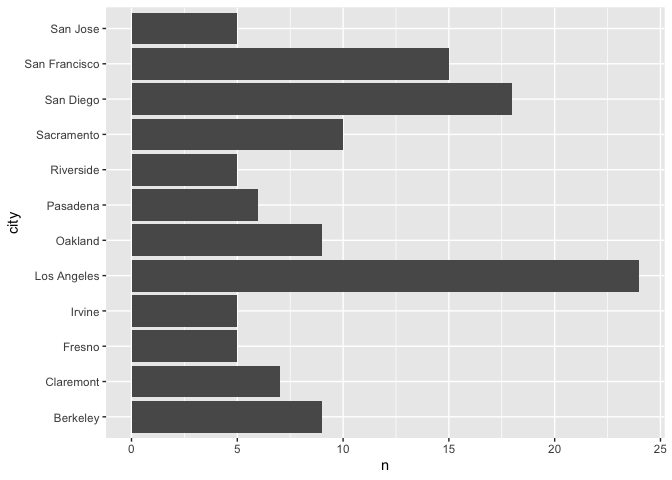
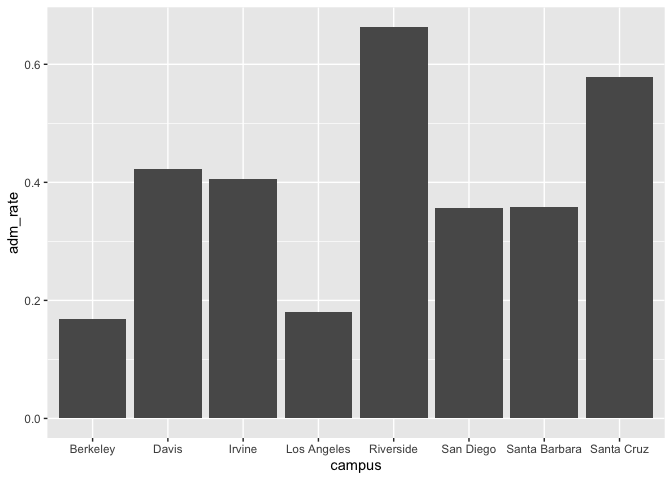

## Instructions
Answer the following questions and complete the exercises in RMarkdown. Please embed all of your code and push your final work to your repository. Your final lab report should be organized, clean, and run free from errors. Remember, you must remove the `#` for the included code chunks to run. Be sure to add your name to the author header above.  

Make sure to use the formatting conventions of RMarkdown to make your report neat and clean!  

## Load the libraries

```r
library(tidyverse)
library(janitor)
library(here)
library(naniar)
```

For this homework, we will take a departure from biological data and use data about California colleges. These data are a subset of the national college scorecard (https://collegescorecard.ed.gov/data/). Load the `ca_college_data.csv` as a new object called `colleges`.

```r
colleges <- read_csv("ca_college_data copy.csv") %>% clean_names()
```

```
## Rows: 341 Columns: 10
## ── Column specification ────────────────────────────────────────────────────────
## Delimiter: ","
## chr (4): INSTNM, CITY, STABBR, ZIP
## dbl (6): ADM_RATE, SAT_AVG, PCIP26, COSTT4_A, C150_4_POOLED, PFTFTUG1_EF
## 
## ℹ Use `spec()` to retrieve the full column specification for this data.
## ℹ Specify the column types or set `show_col_types = FALSE` to quiet this message.
```

The variables are a bit hard to decipher, here is a key:  

INSTNM: Institution name  
CITY: California city  
STABBR: Location state  
ZIP: Zip code  
ADM_RATE: Admission rate  
SAT_AVG: SAT average score  
PCIP26: Percentage of degrees awarded in Biological And Biomedical Sciences  
COSTT4_A: Annual cost of attendance  
C150_4_POOLED: 4-year completion rate  
PFTFTUG1_EF: Percentage of undergraduate students who are first-time, full-time degree/certificate-seeking undergraduate students  

1. Use your preferred function(s) to have a look at the data and get an idea of its structure. Make sure you summarize NA's and determine whether or not the data are tidy. You may also consider dealing with any naming issues.

```r
glimpse(colleges)
```

```
## Rows: 341
## Columns: 10
## $ instnm        <chr> "Grossmont College", "College of the Sequoias", "College…
## $ city          <chr> "El Cajon", "Visalia", "San Mateo", "Ventura", "Oxnard",…
## $ stabbr        <chr> "CA", "CA", "CA", "CA", "CA", "CA", "CA", "CA", "CA", "C…
## $ zip           <chr> "92020-1799", "93277-2214", "94402-3784", "93003-3872", …
## $ adm_rate      <dbl> NA, NA, NA, NA, NA, NA, NA, NA, NA, NA, NA, NA, NA, NA, …
## $ sat_avg       <dbl> NA, NA, NA, NA, NA, NA, NA, NA, NA, NA, NA, NA, NA, NA, …
## $ pcip26        <dbl> 0.0016, 0.0066, 0.0038, 0.0035, 0.0085, 0.0151, 0.0000, …
## $ costt4_a      <dbl> 7956, 8109, 8278, 8407, 8516, 8577, 8580, 9181, 9281, 93…
## $ c150_4_pooled <dbl> NA, NA, NA, NA, NA, NA, 0.2334, NA, NA, NA, NA, 0.1704, …
## $ pftftug1_ef   <dbl> 0.3546, 0.5413, 0.3567, 0.3824, 0.2753, 0.4286, 0.2307, …
```


```r
colleges %>% 
  map_df(~sum(is.na(.)))
```

```
## # A tibble: 1 × 10
##   instnm  city stabbr   zip adm_rate sat_avg pcip26 costt4_a c150_4_pooled
##    <int> <int>  <int> <int>    <int>   <int>  <int>    <int>         <int>
## 1      0     0      0     0      240     276     35      124           221
## # ℹ 1 more variable: pftftug1_ef <int>
```

2. Which cities in California have the highest number of colleges?

```r
colleges %>% 
  count(city) %>% 
  arrange(desc(n))
```

```
## # A tibble: 161 × 2
##    city              n
##    <chr>         <int>
##  1 Los Angeles      24
##  2 San Diego        18
##  3 San Francisco    15
##  4 Sacramento       10
##  5 Berkeley          9
##  6 Oakland           9
##  7 Claremont         7
##  8 Pasadena          6
##  9 Fresno            5
## 10 Irvine            5
## # ℹ 151 more rows
```

3. Based on your answer to #2, make a plot that shows the number of colleges in the top 10 cities.

```r
colleges %>% 
  count(city) %>% 
  arrange(desc(n)) %>% 
  top_n(10, n) %>% 
  ggplot(aes(x=city, y=n))+
  geom_col()+
  coord_flip()
```

<!-- -->


4. The column `COSTT4_A` is the annual cost of each institution. Which city has the highest average cost? Where is it located?

```r
colleges %>% 
  group_by(city) %>% 
  summarize(highest_aver_cost=mean(costt4_a, na.rm = T)) %>% 
  arrange(desc(highest_aver_cost))
```

```
## # A tibble: 161 × 2
##    city                highest_aver_cost
##    <chr>                           <dbl>
##  1 Claremont                       66498
##  2 Malibu                          66152
##  3 Valencia                        64686
##  4 Orange                          64501
##  5 Redlands                        61542
##  6 Moraga                          61095
##  7 Atherton                        56035
##  8 Thousand Oaks                   54373
##  9 Rancho Palos Verdes             50758
## 10 La Verne                        50603
## # ℹ 151 more rows
```

```r
#the city of Claremont is in the LA county
```

5. Based on your answer to #4, make a plot that compares the cost of the individual colleges in the most expensive city. Bonus! Add UC Davis here to see how it compares :>).

```r
colleges %>%
  select(instnm, city, costt4_a) %>% 
  filter(city=="Claremont" & costt4_a !="NA" | instnm=="University of California-Davis") %>% 
  ggplot(aes(x=instnm, y= costt4_a))+
  geom_col()+
  coord_flip()
```

<!-- -->


6. The column `ADM_RATE` is the admissions rate by college and `C150_4_POOLED` is the four-year completion rate. Use a scatterplot to show the relationship between these two variables. What do you think this means?

```r
ggplot(data = colleges,
       mapping = aes(x=adm_rate, y=c150_4_pooled))+
  geom_point(na.rm = T)
```

<!-- -->

7. Is there a relationship between cost and four-year completion rate? (You don't need to do the stats, just produce a plot). What do you think this means?

```r
ggplot(data = colleges,
       mapping = aes(x=costt4_a, y=c150_4_pooled))+
  geom_point(na.rm = T)
```

<!-- -->


8. The column titled `INSTNM` is the institution name. We are only interested in the University of California colleges. Make a new data frame that is restricted to UC institutions. You can remove `Hastings College of Law` and `UC San Francisco` as we are only interested in undergraduate institutions.

Remove `Hastings College of Law` and `UC San Francisco` and store the final data frame as a new object `univ_calif_final`.

```r
univ_calif_final <- colleges %>% 
 filter_all(any_vars(str_detect(.,pattern = "University of California"))) %>%
  filter(city != "San Francisco")
```

Use `separate()` to separate institution name into two new columns "UNIV" and "CAMPUS".

```r
univ_calif_final <- univ_calif_final %>% 
  separate(instnm, into = c("univ", "campus"), sep = "-")
```


9. The column `ADM_RATE` is the admissions rate by campus. Which UC has the lowest and highest admissions rates? Produce a numerical summary and an appropriate plot.

```r
univ_calif_final %>% 
  select(campus, adm_rate) %>% 
  arrange(desc(adm_rate))
```

```
## # A tibble: 8 × 2
##   campus        adm_rate
##   <chr>            <dbl>
## 1 Riverside        0.663
## 2 Santa Cruz       0.578
## 3 Davis            0.423
## 4 Irvine           0.406
## 5 Santa Barbara    0.358
## 6 San Diego        0.357
## 7 Los Angeles      0.180
## 8 Berkeley         0.169
```


```r
univ_calif_final %>% 
  select(campus, adm_rate) %>% 
  arrange(desc(adm_rate)) %>% 
  ggplot(aes(x=campus, y=adm_rate))+
  geom_col()
```

<!-- -->

10. If you wanted to get a degree in biological or biomedical sciences, which campus confers the majority of these degrees? Produce a numerical summary and an appropriate plot.

```r
univ_calif_final %>% 
  select(campus, pcip26) %>% 
  arrange(desc(pcip26))
```

```
## # A tibble: 8 × 2
##   campus        pcip26
##   <chr>          <dbl>
## 1 San Diego      0.216
## 2 Davis          0.198
## 3 Santa Cruz     0.193
## 4 Los Angeles    0.155
## 5 Riverside      0.149
## 6 Santa Barbara  0.108
## 7 Irvine         0.107
## 8 Berkeley       0.105
```


```r
univ_calif_final %>% 
  select(campus, pcip26) %>% 
  arrange(desc(pcip26)) %>% 
  ggplot(aes(x=campus, y=pcip26))+
  geom_col()
```

<!-- -->

## Knit Your Output and Post to [GitHub](https://github.com/FRS417-DataScienceBiologists)
