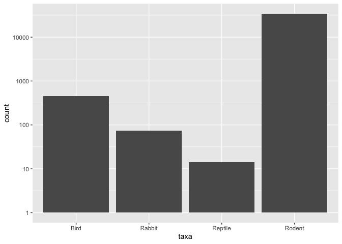
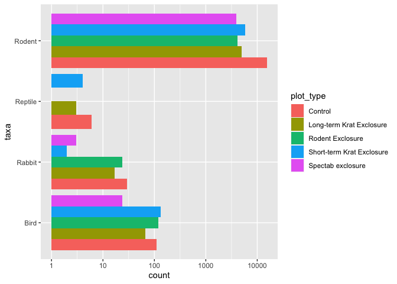
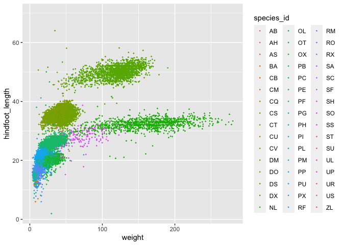
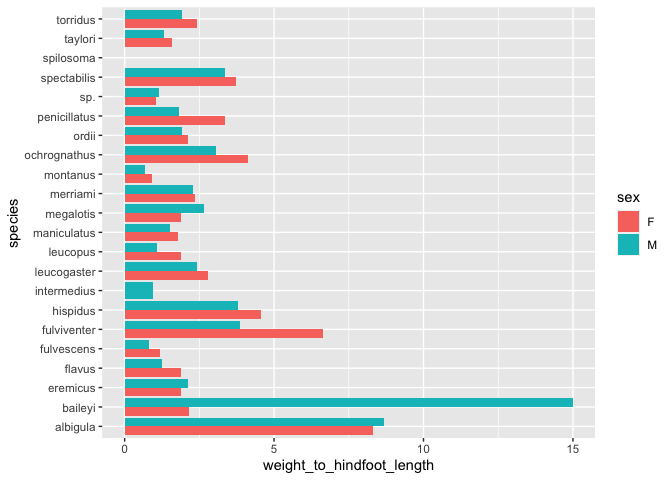
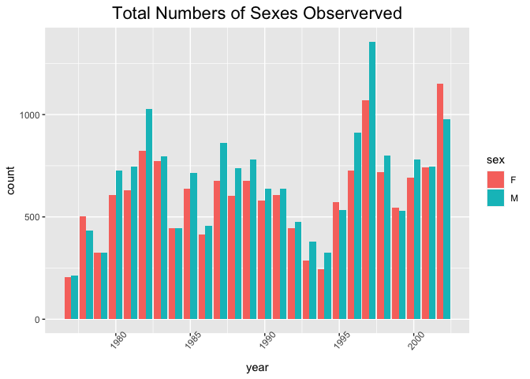

## Instructions
Answer the following questions and complete the exercises in RMarkdown. Please embed all of your code and push your final work to your repository. Your final lab report should be organized, clean, and run free from errors. Remember, you must remove the `#` for the included code chunks to run. Be sure to add your name to the author header above. For any included plots, make sure they are clearly labeled. You are free to use any plot type that you feel best communicates the results of your analysis.  

Make sure to use the formatting conventions of RMarkdown to make your report neat and clean!  

## Load the libraries

```r
library(tidyverse)
library(janitor)
library(naniar)
```


```r
options(scipen=999)
```

## Desert Ecology
For this assignment, we are going to use a modified data set on [desert ecology](http://esapubs.org/archive/ecol/E090/118/). The data are from: S. K. Morgan Ernest, Thomas J. Valone, and James H. Brown. 2009. Long-term monitoring and experimental manipulation of a Chihuahuan Desert ecosystem near Portal, Arizona, USA. Ecology 90:1708.

```r
deserts <- read_csv("surveys_complete copy.csv") %>% clean_names()
```

```
## Rows: 34786 Columns: 13
## ── Column specification ────────────────────────────────────────────────────────
## Delimiter: ","
## chr (6): species_id, sex, genus, species, taxa, plot_type
## dbl (7): record_id, month, day, year, plot_id, hindfoot_length, weight
## 
## ℹ Use `spec()` to retrieve the full column specification for this data.
## ℹ Specify the column types or set `show_col_types = FALSE` to quiet this message.
```

1. Use the function(s) of your choice to get an idea of its structure, including how NA's are treated. Are the data tidy?  

```r
glimpse(deserts)
```

```
## Rows: 34,786
## Columns: 13
## $ record_id       <dbl> 1, 2, 3, 4, 5, 6, 7, 8, 9, 10, 11, 12, 13, 14, 15, 16,…
## $ month           <dbl> 7, 7, 7, 7, 7, 7, 7, 7, 7, 7, 7, 7, 7, 7, 7, 7, 7, 7, …
## $ day             <dbl> 16, 16, 16, 16, 16, 16, 16, 16, 16, 16, 16, 16, 16, 16…
## $ year            <dbl> 1977, 1977, 1977, 1977, 1977, 1977, 1977, 1977, 1977, …
## $ plot_id         <dbl> 2, 3, 2, 7, 3, 1, 2, 1, 1, 6, 5, 7, 3, 8, 6, 4, 3, 2, …
## $ species_id      <chr> "NL", "NL", "DM", "DM", "DM", "PF", "PE", "DM", "DM", …
## $ sex             <chr> "M", "M", "F", "M", "M", "M", "F", "M", "F", "F", "F",…
## $ hindfoot_length <dbl> 32, 33, 37, 36, 35, 14, NA, 37, 34, 20, 53, 38, 35, NA…
## $ weight          <dbl> NA, NA, NA, NA, NA, NA, NA, NA, NA, NA, NA, NA, NA, NA…
## $ genus           <chr> "Neotoma", "Neotoma", "Dipodomys", "Dipodomys", "Dipod…
## $ species         <chr> "albigula", "albigula", "merriami", "merriami", "merri…
## $ taxa            <chr> "Rodent", "Rodent", "Rodent", "Rodent", "Rodent", "Rod…
## $ plot_type       <chr> "Control", "Long-term Krat Exclosure", "Control", "Rod…
```
NA's

```r
deserts %>% 
  map_df(~sum(is.na(.)))
```

```
## # A tibble: 1 × 13
##   record_id month   day  year plot_id species_id   sex hindfoot_length weight
##       <int> <int> <int> <int>   <int>      <int> <int>           <int>  <int>
## 1         0     0     0     0       0          0  1748            3348   2503
## # ℹ 4 more variables: genus <int>, species <int>, taxa <int>, plot_type <int>
```

2. How many genera and species are represented in the data? What are the total number of observations? Which species is most/ least frequently sampled in the study?

```r
gen_spec <- deserts %>%
  count(genus, species) %>% 
  arrange(desc(n))
```


```r
#most sampled
head(gen_spec)
```

```
## # A tibble: 6 × 3
##   genus           species          n
##   <chr>           <chr>        <int>
## 1 Dipodomys       merriami     10596
## 2 Chaetodipus     penicillatus  3123
## 3 Dipodomys       ordii         3027
## 4 Chaetodipus     baileyi       2891
## 5 Reithrodontomys megalotis     2609
## 6 Dipodomys       spectabilis   2504
```

```r
#least sampled
tail(gen_spec)
```

```
## # A tibble: 6 × 3
##   genus         species          n
##   <chr>         <chr>        <int>
## 1 Cnemidophorus tigris           1
## 2 Cnemidophorus uniparens        1
## 3 Crotalus      scutalatus       1
## 4 Crotalus      viridis          1
## 5 Sceloporus    clarki           1
## 6 Spermophilus  tereticaudus     1
```

3. What is the proportion of taxa included in this study? Show a table and plot that reflects this count.

```r
deserts %>% 
  count(taxa)
```

```
## # A tibble: 4 × 2
##   taxa        n
##   <chr>   <int>
## 1 Bird      450
## 2 Rabbit     75
## 3 Reptile    14
## 4 Rodent  34247
```


```r
deserts %>% 
  ggplot(aes(x=taxa))+
  geom_bar()+
  scale_y_log10()
```

<!-- -->

4. For the taxa included in the study, use the fill option to show the proportion of individuals sampled by `plot_type.`

```r
deserts %>% 
  ggplot(aes(x=taxa, fill = plot_type))+
  geom_bar(position = "dodge")+
  scale_y_log10()+
  coord_flip()
```

<!-- -->

5. What is the range of weight for each species included in the study? Remove any observations of weight that are NA so they do not show up in the plot.

```r
deserts %>% 
  ggplot(aes(x=species, y=weight))+
  geom_boxplot(na.rm = T)+
  coord_flip()
```

<!-- -->

6. Add another layer to your answer from #5 using `geom_point` to get an idea of how many measurements were taken for each species.

```r
deserts %>% 
  ggplot(aes(x=species, y=weight))+
  geom_boxplot(na.rm = T)+
  coord_flip()+
  geom_jitter(na.rm = T)
```

<!-- -->

7. [Dipodomys merriami](https://en.wikipedia.org/wiki/Merriam's_kangaroo_rat) is the most frequently sampled animal in the study. How have the number of observations of this species changed over the years included in the study?

```r
deserts %>% 
  filter(species=="merriami")
```

```
## # A tibble: 10,596 × 13
##    record_id month   day  year plot_id species_id sex   hindfoot_length weight
##        <dbl> <dbl> <dbl> <dbl>   <dbl> <chr>      <chr>           <dbl>  <dbl>
##  1         3     7    16  1977       2 DM         F                  37     NA
##  2         4     7    16  1977       7 DM         M                  36     NA
##  3         5     7    16  1977       3 DM         M                  35     NA
##  4         8     7    16  1977       1 DM         M                  37     NA
##  5         9     7    16  1977       1 DM         F                  34     NA
##  6        12     7    16  1977       7 DM         M                  38     NA
##  7        13     7    16  1977       3 DM         M                  35     NA
##  8        14     7    16  1977       8 DM         <NA>               NA     NA
##  9        15     7    16  1977       6 DM         F                  36     NA
## 10        16     7    16  1977       4 DM         F                  36     NA
## # ℹ 10,586 more rows
## # ℹ 4 more variables: genus <chr>, species <chr>, taxa <chr>, plot_type <chr>
```

8. What is the relationship between `weight` and `hindfoot` length? Consider whether or not over plotting is an issue.

```r
deserts %>% 
  ggplot(aes(x=weight, y=hindfoot_length, color = species_id))+
  geom_jitter(na.rm = T, size = 0.2)
```

<!-- -->

9. Which two species have, on average, the highest weight? Once you have identified them, make a new column that is a ratio of `weight` to `hindfoot_length`. Make a plot that shows the range of this new ratio and fill by sex.

```r
deserts %>% 
  group_by(species) %>%
  filter(weight != "NA") %>% 
  summarise(max_weight=max(weight)) %>% 
  arrange(desc(max_weight))
```

```
## # A tibble: 22 × 2
##    species      max_weight
##    <chr>             <dbl>
##  1 albigula            280
##  2 fulviventer         199
##  3 spectabilis         190
##  4 hispidus            140
##  5 spilosoma           130
##  6 ochrognathus        105
##  7 ordii                76
##  8 penicillatus         74
##  9 merriami             66
## 10 leucogaster          56
## # ℹ 12 more rows
```


```r
deserts %>% 
  filter(weight != "NA") %>% 
  mutate(weight_to_hindfoot_length = weight/hindfoot_length) %>% 
  select(species, weight, hindfoot_length, weight_to_hindfoot_length) %>% 
  arrange(desc(weight_to_hindfoot_length))
```

```
## # A tibble: 32,283 × 4
##    species  weight hindfoot_length weight_to_hindfoot_length
##    <chr>     <dbl>           <dbl>                     <dbl>
##  1 baileyi      30               2                     15   
##  2 albigula    278              32                      8.69
##  3 albigula    280              33                      8.48
##  4 albigula    270              32                      8.44
##  5 albigula    274              33                      8.30
##  6 albigula    253              32                      7.91
##  7 albigula    260              33                      7.88
##  8 albigula    252              32                      7.88
##  9 albigula    259              33                      7.85
## 10 albigula    259              33                      7.85
## # ℹ 32,273 more rows
```


```r
deserts %>% 
  filter(weight != "NA" & sex != "NA") %>% 
  mutate(weight_to_hindfoot_length = weight/hindfoot_length) %>% 
  select(species, sex, weight, hindfoot_length, weight_to_hindfoot_length) %>% 
  ggplot(aes(x=species, y=weight_to_hindfoot_length, fill = sex))+
  geom_col(position = "dodge", na.rm = T)+
  coord_flip()
```

<!-- -->

10. Make one plot of your choice! Make sure to include at least two of the aesthetics options you have learned.

```r
deserts %>% 
  filter(sex != "NA") %>% 
  ggplot(aes(x=year, fill = sex))+
  geom_bar(position = "dodge")+
  theme(plot.title = element_text(size = rel(1.5), hjust = 0.5),
        axis.text.x = element_text(angle = 50, hjust = 0.5))+
  labs(title = "Total Numbers of Sexes Observerved")
```

<!-- -->

## Push your final code to GitHub!
Please be sure that you check the `keep md` file in the knit preferences. 
