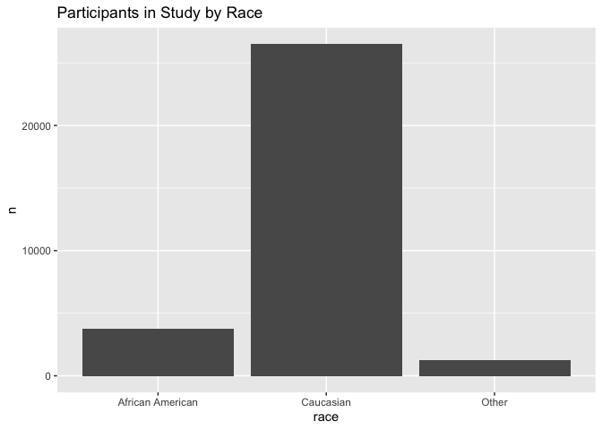
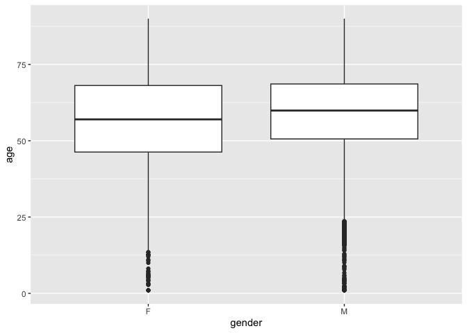
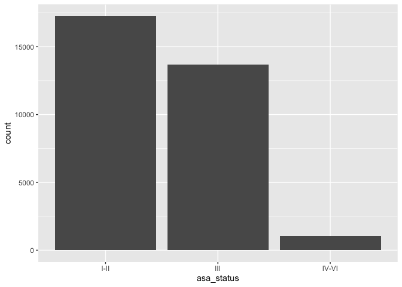
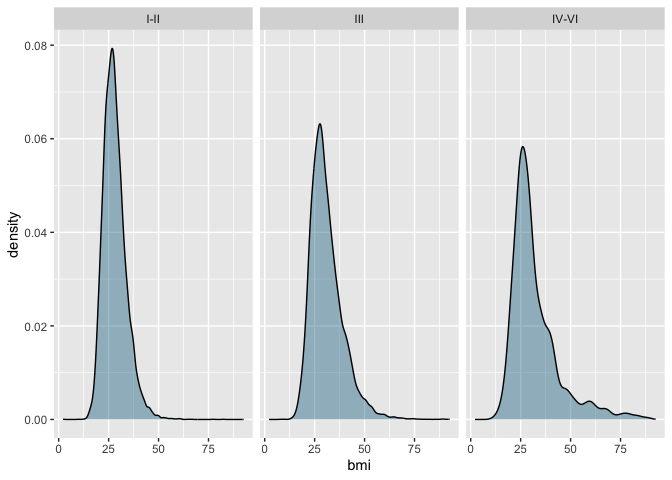
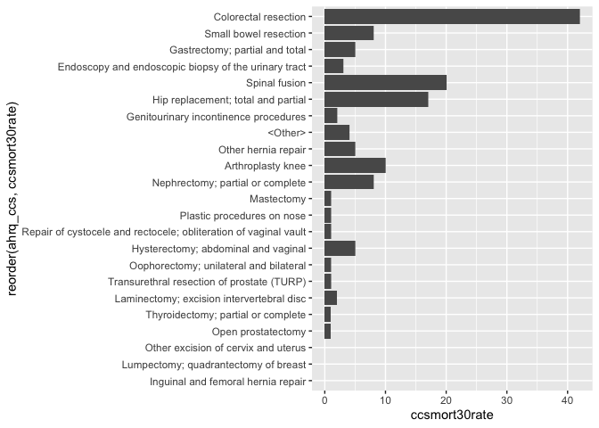

## Instructions
Answer the following questions and complete the exercises in RMarkdown. Please embed all of your code and push your final work to your repository. Your code should be organized, clean, and run free from errors. Remember, you must remove the `#` for any included code chunks to run. Be sure to add your name to the author header above.  

Make sure to use the formatting conventions of RMarkdown to make your report neat and clean! Use the tidyverse and pipes unless otherwise indicated. To receive full credit, all plots must have clearly labeled axes, a title, and consistent aesthetics. This exam is worth a total of 35 points. 

Please load the following libraries.

```r
library("tidyverse")
library("janitor")
library("naniar")
```

## Data
These data are from a study on surgical residents. The study was originally published by Sessier et al. “Operation Timing and 30-Day Mortality After Elective General Surgery”. Anesth Analg 2011; 113: 1423-8. The data were cleaned for instructional use by Amy S. Nowacki, “Surgery Timing Dataset”, TSHS Resources Portal (2016). Available at https://www.causeweb.org/tshs/surgery-timing/.

Descriptions of the variables and the study are included as pdf's in the data folder.  

Please run the following chunk to import the data.

```r
surgery <- read_csv("surgery.csv")
```

1. Use the summary function(s) of your choice to explore the data and get an idea of its structure. Please also check for NA's.

```r
glimpse(surgery)
```

```
## Rows: 32,001
## Columns: 25
## $ ahrq_ccs            <chr> "<Other>", "<Other>", "<Other>", "<Other>", "<Othe…
## $ age                 <dbl> 67.8, 39.5, 56.5, 71.0, 56.3, 57.7, 56.6, 64.2, 66…
## $ gender              <chr> "M", "F", "F", "M", "M", "F", "M", "F", "M", "F", …
## $ race                <chr> "Caucasian", "Caucasian", "Caucasian", "Caucasian"…
## $ asa_status          <chr> "I-II", "I-II", "I-II", "III", "I-II", "I-II", "IV…
## $ bmi                 <dbl> 28.04, 37.85, 19.56, 32.22, 24.32, 40.30, 64.57, 4…
## $ baseline_cancer     <chr> "No", "No", "No", "No", "Yes", "No", "No", "No", "…
## $ baseline_cvd        <chr> "Yes", "Yes", "No", "Yes", "No", "Yes", "Yes", "Ye…
## $ baseline_dementia   <chr> "No", "No", "No", "No", "No", "No", "No", "No", "N…
## $ baseline_diabetes   <chr> "No", "No", "No", "No", "No", "No", "Yes", "No", "…
## $ baseline_digestive  <chr> "Yes", "No", "No", "No", "No", "No", "No", "No", "…
## $ baseline_osteoart   <chr> "No", "No", "No", "No", "No", "No", "No", "No", "N…
## $ baseline_psych      <chr> "No", "No", "No", "No", "No", "Yes", "No", "No", "…
## $ baseline_pulmonary  <chr> "No", "No", "No", "No", "No", "No", "No", "No", "N…
## $ baseline_charlson   <dbl> 0, 0, 0, 0, 0, 0, 2, 0, 1, 2, 0, 1, 0, 0, 0, 0, 0,…
## $ mortality_rsi       <dbl> -0.63, -0.63, -0.49, -1.38, 0.00, -0.77, -0.36, -0…
## $ complication_rsi    <dbl> -0.26, -0.26, 0.00, -1.15, 0.00, -0.84, -1.34, 0.0…
## $ ccsmort30rate       <dbl> 0.0042508, 0.0042508, 0.0042508, 0.0042508, 0.0042…
## $ ccscomplicationrate <dbl> 0.07226355, 0.07226355, 0.07226355, 0.07226355, 0.…
## $ hour                <dbl> 9.03, 18.48, 7.88, 8.80, 12.20, 7.67, 9.53, 7.52, …
## $ dow                 <chr> "Mon", "Wed", "Fri", "Wed", "Thu", "Thu", "Tue", "…
## $ month               <chr> "Nov", "Sep", "Aug", "Jun", "Aug", "Dec", "Apr", "…
## $ moonphase           <chr> "Full Moon", "New Moon", "Full Moon", "Last Quarte…
## $ mort30              <chr> "No", "No", "No", "No", "No", "No", "No", "No", "N…
## $ complication        <chr> "No", "No", "No", "No", "No", "No", "No", "Yes", "…
```


```r
surgery %>% 
  map_df(~ sum(is.na(.)))
```

```
## # A tibble: 1 × 25
##   ahrq_ccs   age gender  race asa_status   bmi baseline_cancer baseline_cvd
##      <int> <int>  <int> <int>      <int> <int>           <int>        <int>
## 1        0     2      3   480          8  3290               0            0
## # ℹ 17 more variables: baseline_dementia <int>, baseline_diabetes <int>,
## #   baseline_digestive <int>, baseline_osteoart <int>, baseline_psych <int>,
## #   baseline_pulmonary <int>, baseline_charlson <int>, mortality_rsi <int>,
## #   complication_rsi <int>, ccsmort30rate <int>, ccscomplicationrate <int>,
## #   hour <int>, dow <int>, month <int>, moonphase <int>, mort30 <int>,
## #   complication <int>
```

2. Let's explore the participants in the study. Show a count of participants by race AND make a plot that visually represents your output.

```r
surgery %>% 
  filter(race != "NA") %>% 
  count(race) %>%
  ggplot(aes(x=race, y= n))+
  geom_col()+
  labs(title = "Participants in Study by Race")
```

<!-- -->

3. What is the mean age of participants by gender? (hint: please provide a number for each) Since only three participants do not have gender indicated, remove these participants from the data.

```r
surgery %>% 
  filter(gender=="M" & age != "NA") %>% 
  summarise(mean_age=mean(age))
```

```
## # A tibble: 1 × 1
##   mean_age
##      <dbl>
## 1     58.8
```


```r
surgery %>% 
  filter(gender=="F" & age != "NA") %>% 
  summarise(mean_age=mean(age))
```

```
## # A tibble: 1 × 1
##   mean_age
##      <dbl>
## 1     56.7
```

4. Make a plot that shows the range of age associated with gender.

```r
surgery %>% 
  filter(gender != "NA" & age != "NA") %>% 
  ggplot(aes(x=gender, y= age))+
  geom_boxplot()
```

<!-- -->

5. How healthy are the participants? The variable `asa_status` is an evaluation of patient physical status prior to surgery. Lower numbers indicate fewer comorbidities (presence of two or more diseases or medical conditions in a patient). Make a plot that compares the number of `asa_status` I-II, III, and IV-V.

```r
surgery %>% 
  filter(asa_status != "NA") %>% 
  ggplot(aes(asa_status))+
  geom_bar()
```

<!-- -->

6. Create a plot that displays the distribution of body mass index for each `asa_status` as a probability distribution- not a histogram. (hint: use faceting!)

```r
surgery %>% 
  filter(asa_status != "NA") %>% 
  ggplot(aes(x=bmi))+
  geom_density(fill="deepskyblue4", alpha  =0.4, color = "black")+
  facet_wrap(~ asa_status)
```

```
## Warning: Removed 3289 rows containing non-finite values (`stat_density()`).
```

<!-- -->

The variable `ccsmort30rate` is a measure of the overall 30-day mortality rate associated with each type of operation. The variable `ccscomplicationrate` is a measure of the 30-day in-hospital complication rate. The variable `ahrq_ccs` lists each type of operation.  

7. What are the 5 procedures associated with highest risk of 30-day mortality AND how do they compare with the 5 procedures with highest risk of complication? (hint: no need for a plot here)

```r
surgery %>% 
  count(ahrq_ccs, ccsmort30rate) %>% 
  arrange(desc(ccsmort30rate)) %>% 
   top_n(5, ccsmort30rate)
```

```
## # A tibble: 5 × 3
##   ahrq_ccs                                             ccsmort30rate     n
##   <chr>                                                        <dbl> <int>
## 1 Colorectal resection                                       0.0167   2519
## 2 Small bowel resection                                      0.0129    620
## 3 Gastrectomy; partial and total                             0.0127    394
## 4 Endoscopy and endoscopic biopsy of the urinary tract       0.00811   370
## 5 Spinal fusion                                              0.00742  2694
```


```r
surgery %>% 
  count(ahrq_ccs, ccscomplicationrate) %>% 
  arrange(desc(ccscomplicationrate)) %>% 
  top_n(5,ccscomplicationrate)
```

```
## # A tibble: 5 × 3
##   ahrq_ccs                         ccscomplicationrate     n
##   <chr>                                          <dbl> <int>
## 1 Small bowel resection                          0.466   620
## 2 Colorectal resection                           0.312  2519
## 3 Nephrectomy; partial or complete               0.197  2894
## 4 Gastrectomy; partial and total                 0.190   394
## 5 Spinal fusion                                  0.183  2694
```

8. Make a plot that compares the `ccsmort30rate` for all listed `ahrq_ccs` procedures.

```r
surgery %>% 
  ggplot(aes(x = reorder(ahrq_ccs, ccsmort30rate), y = ccsmort30rate))+
  geom_col()+
  coord_flip()
```

<!-- -->

9. When is the best month to have surgery? Make a chart that shows the 30-day mortality and complications for the patients by month. `mort30` is the variable that shows whether or not a patient survived 30 days post-operation.

```r
surgery %>% 
  select(month, mort30, complication)
```

```
## # A tibble: 32,001 × 3
##    month mort30 complication
##    <chr> <chr>  <chr>       
##  1 Nov   No     No          
##  2 Sep   No     No          
##  3 Aug   No     No          
##  4 Jun   No     No          
##  5 Aug   No     No          
##  6 Dec   No     No          
##  7 Apr   No     No          
##  8 Sep   No     Yes         
##  9 Apr   No     No          
## 10 Sep   No     No          
## # ℹ 31,991 more rows
```

10. Make a plot that visualizes the chart from question #9. Make sure that the months are on the x-axis. Do a search online and figure out how to order the months Jan-Dec.


Please be 100% sure your exam is saved, knitted, and pushed to your github repository. No need to submit a link on canvas, we will find your exam in your repository.
