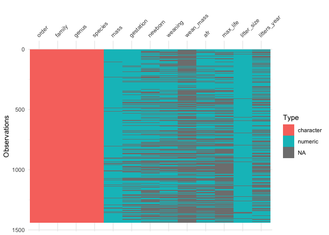
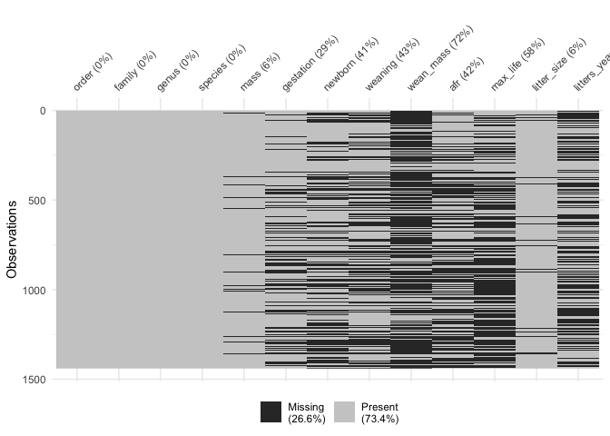

## Learning Goals
*At the end of this exercise, you will be able to:*    
1. Define `NA` and describe how they are treated in R.  
2. Produce summaries of the number of NA's in a data set.   
3. Replace values with `NA` in a data set as appropriate.  


```r
#install.packages("naniar")
```

## Load the libraries

```r
library("tidyverse")
library("naniar")
library("skimr")
library("janitor")
```

## Review
When working with "wild" data, dealing with NA's is a fundamental part of the data cleaning process. Data scientists spend most of their time cleaning and transforming data- including managing NA's. There isn't a single approach that will always work so you need to be careful about using replacement strategies across an entire data set. And, as the data sets become larger NA's can become trickier to deal with.  

For the following, we will use life history data for mammals. The [data](http://esapubs.org/archive/ecol/E084/093/) are from:  
**S. K. Morgan Ernest. 2003. Life history characteristics of placental non-volant mammals. Ecology 84:3402.**  

## Load the mammals life history data and clean the names  

```r
life_history <- read_csv("data/mammal_lifehistories_v3.csv") %>% clean_names()
```

```
## Rows: 1440 Columns: 13
## ── Column specification ────────────────────────────────────────────────────────
## Delimiter: ","
## chr (5): order, family, Genus, species, newborn
## dbl (8): mass, gestation, weaning, wean mass, AFR, max. life, litter size, l...
## 
## ℹ Use `spec()` to retrieve the full column specification for this data.
## ℹ Specify the column types or set `show_col_types = FALSE` to quiet this message.
```

## Are there any NA's?
Sometimes using one or more of the summary functions can give us clues to how the authors have represented missing data. This doesn't always work, but it is a good place to start.

```r
glimpse(life_history)
```

```
## Rows: 1,440
## Columns: 13
## $ order        <chr> "Artiodactyla", "Artiodactyla", "Artiodactyla", "Artiodac…
## $ family       <chr> "Antilocapridae", "Bovidae", "Bovidae", "Bovidae", "Bovid…
## $ genus        <chr> "Antilocapra", "Addax", "Aepyceros", "Alcelaphus", "Ammod…
## $ species      <chr> "americana", "nasomaculatus", "melampus", "buselaphus", "…
## $ mass         <dbl> 45375.0, 182375.0, 41480.0, 150000.0, 28500.0, 55500.0, 3…
## $ gestation    <dbl> 8.13, 9.39, 6.35, 7.90, 6.80, 5.08, 5.72, 5.50, 8.93, 9.1…
## $ newborn      <chr> "3246.36", "5480", "5093", "10166.67", "not measured", "3…
## $ weaning      <dbl> 3.00, 6.50, 5.63, 6.50, -999.00, 4.00, 4.04, 2.13, 10.71,…
## $ wean_mass    <dbl> 8900, -999, 15900, -999, -999, -999, -999, -999, 157500, …
## $ afr          <dbl> 13.53, 27.27, 16.66, 23.02, -999.00, 14.89, 10.23, 20.13,…
## $ max_life     <dbl> 142, 308, 213, 240, 0, 251, 228, 255, 300, 324, 300, 314,…
## $ litter_size  <dbl> 1.85, 1.00, 1.00, 1.00, 1.00, 1.37, 1.00, 1.00, 1.00, 1.0…
## $ litters_year <dbl> 1.00, 0.99, 0.95, NA, NA, 2.00, NA, 1.89, 1.00, 1.00, 0.7…
```


```r
summary(life_history)
```

```
##     order              family             genus             species         
##  Length:1440        Length:1440        Length:1440        Length:1440       
##  Class :character   Class :character   Class :character   Class :character  
##  Mode  :character   Mode  :character   Mode  :character   Mode  :character  
##                                                                             
##                                                                             
##                                                                             
##                                                                             
##       mass             gestation         newborn             weaning       
##  Min.   :     -999   Min.   :-999.00   Length:1440        Min.   :-999.00  
##  1st Qu.:       50   1st Qu.:-999.00   Class :character   1st Qu.:-999.00  
##  Median :      403   Median :   1.05   Mode  :character   Median :   0.73  
##  Mean   :   383577   Mean   :-287.25                      Mean   :-427.17  
##  3rd Qu.:     7009   3rd Qu.:   4.50                      3rd Qu.:   2.00  
##  Max.   :149000000   Max.   :  21.46                      Max.   :  48.00  
##                                                                            
##    wean_mass             afr             max_life        litter_size      
##  Min.   :    -999   Min.   :-999.00   Min.   :   0.00   Min.   :-999.000  
##  1st Qu.:    -999   1st Qu.:-999.00   1st Qu.:   0.00   1st Qu.:   1.000  
##  Median :    -999   Median :   2.50   Median :   0.00   Median :   2.270  
##  Mean   :   16049   Mean   :-408.12   Mean   :  93.19   Mean   : -55.634  
##  3rd Qu.:      10   3rd Qu.:  15.61   3rd Qu.: 147.25   3rd Qu.:   3.835  
##  Max.   :19075000   Max.   : 210.00   Max.   :1368.00   Max.   :  14.180  
##                                                                           
##   litters_year  
##  Min.   :0.140  
##  1st Qu.:1.000  
##  Median :1.000  
##  Mean   :1.636  
##  3rd Qu.:2.000  
##  Max.   :7.500  
##  NA's   :689
```

Here is a new one for you using the `purrr` package. This will give you a quick summary of the number of NA's in each variable.

```r
life_history %>% 
  map_df(~ sum(is.na(.))) #map as a data frame all of the NAs
```

```
## # A tibble: 1 × 13
##   order family genus species  mass gestation newborn weaning wean_mass   afr
##   <int>  <int> <int>   <int> <int>     <int>   <int>   <int>     <int> <int>
## 1     0      0     0       0     0         0       0       0         0     0
## # ℹ 3 more variables: max_life <int>, litter_size <int>, litters_year <int>
```

## Practice
1. Can we use a single approach to deal with NA's in this data set? Given what you learned in the previous lab, how would you manage the NA values?

```r
life_history <- read_csv("data/mammal_lifehistories_v3.csv", na = c("NA", " ", ".", "-999", "-999.00", "not measured")) %>% clean_names()
```

```
## Warning: One or more parsing issues, call `problems()` on your data frame for details,
## e.g.:
##   dat <- vroom(...)
##   problems(dat)
```

```
## Rows: 1440 Columns: 13
## ── Column specification ────────────────────────────────────────────────────────
## Delimiter: ","
## chr (4): order, family, Genus, species
## dbl (9): mass, gestation, newborn, weaning, wean mass, AFR, max. life, litte...
## 
## ℹ Use `spec()` to retrieve the full column specification for this data.
## ℹ Specify the column types or set `show_col_types = FALSE` to quiet this message.
```

```r
#you need to know how the NA's are represented in the data 
#you do not want to do this by default 
```

## `naniar`
`naniar` is a package that is built to manage NA's. Many of the functions it performs can also be performed using tidyverse functions, but it does provide some interesting alternatives.  

`miss_var_summary` provides a clean summary of NA's across the data frame.

```r
naniar::miss_var_summary(life_history) #tells us the missing data and the percentage 
```

```
## # A tibble: 13 × 3
##    variable     n_miss pct_miss
##    <chr>         <int>    <dbl>
##  1 wean_mass      1039    72.2 
##  2 litters_year    689    47.8 
##  3 weaning         619    43.0 
##  4 afr             607    42.2 
##  5 newborn         595    41.3 
##  6 gestation       418    29.0 
##  7 mass             85     5.90
##  8 litter_size      84     5.83
##  9 order             0     0   
## 10 family            0     0   
## 11 genus             0     0   
## 12 species           0     0   
## 13 max_life          0     0
```

Notice that `max_life` has no NA's. Does that make sense in the context of this data?

```r
hist(life_history$max_life)
```

<!-- -->

Let's use `mutate()` and `na_if()` to replace 0's with NA's in `max_life`.

```r
life_history <- 
  life_history %>% 
  mutate(max_life=na_if(max_life, 0))#in the max_life some mammals have a max life of 0, that does not make sense
```


```r
miss_var_summary(life_history)
```

```
## # A tibble: 13 × 3
##    variable     n_miss pct_miss
##    <chr>         <int>    <dbl>
##  1 wean_mass      1039    72.2 
##  2 max_life        841    58.4 
##  3 litters_year    689    47.8 
##  4 weaning         619    43.0 
##  5 afr             607    42.2 
##  6 newborn         595    41.3 
##  7 gestation       418    29.0 
##  8 mass             85     5.90
##  9 litter_size      84     5.83
## 10 order             0     0   
## 11 family            0     0   
## 12 genus             0     0   
## 13 species           0     0
```

We can also use `miss_var_summary` with `group_by()`. This helps us better evaluate where NA's are in the data.

```r
life_history %>%
  group_by(order) %>%
  select(order, wean_mass) %>% 
  miss_var_summary(order=T)
```

```
## # A tibble: 17 × 4
## # Groups:   order [17]
##    order          variable  n_miss pct_miss
##    <chr>          <chr>      <int>    <dbl>
##  1 Artiodactyla   wean_mass    134     83.2
##  2 Carnivora      wean_mass    120     60.9
##  3 Cetacea        wean_mass     51     92.7
##  4 Dermoptera     wean_mass      2    100  
##  5 Hyracoidea     wean_mass      3     75  
##  6 Insectivora    wean_mass     67     73.6
##  7 Lagomorpha     wean_mass     28     66.7
##  8 Macroscelidea  wean_mass      8     80  
##  9 Perissodactyla wean_mass     12     80  
## 10 Pholidota      wean_mass      3     42.9
## 11 Primates       wean_mass    108     69.2
## 12 Proboscidea    wean_mass      1     50  
## 13 Rodentia       wean_mass    474     71.3
## 14 Scandentia     wean_mass      5     71.4
## 15 Sirenia        wean_mass      4     80  
## 16 Tubulidentata  wean_mass      0      0  
## 17 Xenarthra      wean_mass     19     95
```

`naniar` also has a nice replace function which will allow you to precisely control which values you want replaced with NA's in each variable.

```r
life_history %>% 
  replace_with_na(replace = list(newborn = "not measured", #all of these are a list of how NA is represented in the data 
                                 weaning= -999, 
                                 wean_mass= -999, 
                                 afr= -999, 
                                 max_life= 0, 
                                 litter_size= -999, 
                                 gestation= -999, 
                                 mass= -999)) %>% 
miss_var_summary()
```

```
## # A tibble: 13 × 3
##    variable     n_miss pct_miss
##    <chr>         <int>    <dbl>
##  1 wean_mass      1039    72.2 
##  2 max_life        841    58.4 
##  3 litters_year    689    47.8 
##  4 weaning         619    43.0 
##  5 afr             607    42.2 
##  6 newborn         595    41.3 
##  7 gestation       418    29.0 
##  8 mass             85     5.90
##  9 litter_size      84     5.83
## 10 order             0     0   
## 11 family            0     0   
## 12 genus             0     0   
## 13 species           0     0
```

## Practice
Let's practice evaluating NA's in a large data set. The data are compiled from [CITES](https://cites.org/eng). This is the international organization that tracks trade in endangered wildlife. You can find information about the data [here](https://www.kaggle.com/cites/cites-wildlife-trade-database).  

Some key information:  
[country codes](https://en.wikipedia.org/wiki/ISO_3166-1_alpha-2)  

1. Import the data and do a little exploration. Be sure to clean the names if necessary.

```r
cites <- read.csv("data/cites.csv") %>% 
  clean_names()
```

2. Use `naniar` to summarize the NA's in each variable.

```r
miss_var_summary(cites)
```

```
## # A tibble: 16 × 3
##    variable                   n_miss pct_miss
##    <chr>                       <int>    <dbl>
##  1 importer_reported_quantity  35295   52.6  
##  2 exporter_reported_quantity  23140   34.5  
##  3 exporter                      573    0.853
##  4 origin                         91    0.135
##  5 importer                       71    0.106
##  6 year                            0    0    
##  7 app                             0    0    
##  8 taxon                           0    0    
##  9 class                           0    0    
## 10 order                           0    0    
## 11 family                          0    0    
## 12 genus                           0    0    
## 13 term                            0    0    
## 14 unit                            0    0    
## 15 purpose                         0    0    
## 16 source                          0    0
```

3. Try using `group_by()` with `naniar`. Look specifically at class and `exporter_reported_quantity`. For which taxonomic classes do we have a high proportion of missing export data?

```r
cites %>% 
  group_by(class) %>% 
  select(class, exporter_reported_quantity) %>% 
  miss_var_summary() %>% 
  arrange(desc(pct_miss))
```

```
## # A tibble: 17 × 4
## # Groups:   class [17]
##    class            variable                   n_miss pct_miss
##    <chr>            <chr>                       <int>    <dbl>
##  1 "Holothuroidea"  exporter_reported_quantity     10    100  
##  2 "Dipneusti"      exporter_reported_quantity      3     75  
##  3 "Bivalvia"       exporter_reported_quantity    165     61.3
##  4 "Gastropoda"     exporter_reported_quantity    104     54.5
##  5 "Elasmobranchii" exporter_reported_quantity     58     51.3
##  6 "Arachnida"      exporter_reported_quantity     32     47.8
##  7 "Amphibia"       exporter_reported_quantity    190     45.2
##  8 "Anthozoa"       exporter_reported_quantity   3858     43.9
##  9 "Mammalia"       exporter_reported_quantity   3731     43.9
## 10 ""               exporter_reported_quantity   7002     34.6
## 11 "Hydrozoa"       exporter_reported_quantity     61     33.7
## 12 "Hirudinoidea"   exporter_reported_quantity     11     32.4
## 13 "Reptilia"       exporter_reported_quantity   5323     28.9
## 14 "Actinopteri"    exporter_reported_quantity    726     26.3
## 15 "Aves"           exporter_reported_quantity   1792     26.1
## 16 "Insecta"        exporter_reported_quantity     74     23.9
## 17 "Coelacanthi"    exporter_reported_quantity      0      0
```

## Visualizing NAs
There is another package `visdat` that can be used to visualize the proportion of different classes of data, including missing data. But, it is limited by size.

```r
library(visdat)
```


```r
vis_dat(life_history) #classes of data
```

<!-- -->


```r
vis_miss(life_history)
```

<!-- -->

## Dealing with NA's in advance
If you are sure that you know how NA's are treated in the data, then you can deal with them in advance using `na()` as part of the `readr` package.

```r
life_history_advance <- 
  readr::read_csv(file = "data/mammal_lifehistories_v3.csv", 
                  na = c("NA", " ", ".", "-999")) #all NA, blank spaces, .,and -999 are treated as NA
```

```
## Warning: One or more parsing issues, call `problems()` on your data frame for details,
## e.g.:
##   dat <- vroom(...)
##   problems(dat)
```

```
## Rows: 1440 Columns: 13
## ── Column specification ────────────────────────────────────────────────────────
## Delimiter: ","
## chr (5): order, family, Genus, species, newborn
## dbl (8): mass, gestation, weaning, wean mass, AFR, max. life, litter size, l...
## 
## ℹ Use `spec()` to retrieve the full column specification for this data.
## ℹ Specify the column types or set `show_col_types = FALSE` to quiet this message.
```

```r
#only should be usd when you know for sure how the NAs are represented in the data 
```


```r
miss_var_summary(life_history_advance)
```

```
## # A tibble: 13 × 3
##    variable     n_miss pct_miss
##    <chr>         <int>    <dbl>
##  1 wean mass      1039    72.2 
##  2 litters/year    689    47.8 
##  3 weaning         619    43.0 
##  4 AFR             607    42.2 
##  5 gestation       418    29.0 
##  6 mass             85     5.90
##  7 litter size      84     5.83
##  8 order             0     0   
##  9 family            0     0   
## 10 Genus             0     0   
## 11 species           0     0   
## 12 newborn           0     0   
## 13 max. life         0     0
```

## Wrap-up  
Please review the learning goals and be sure to use the code here as a reference when completing the homework.

-->[Home](https://jmledford3115.github.io/datascibiol/)
